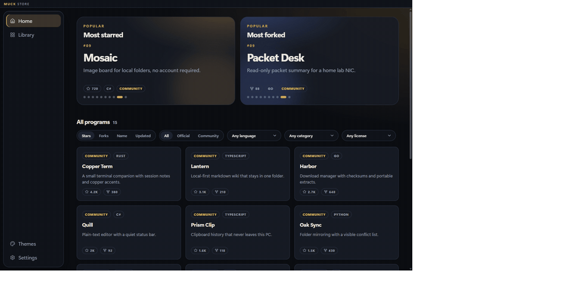
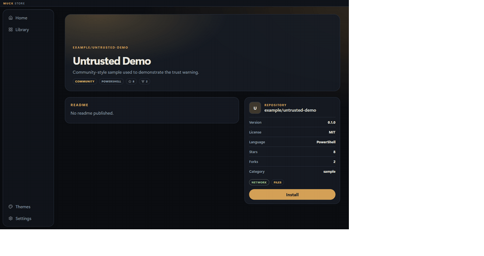
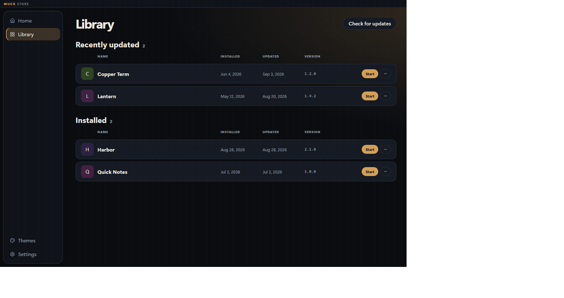
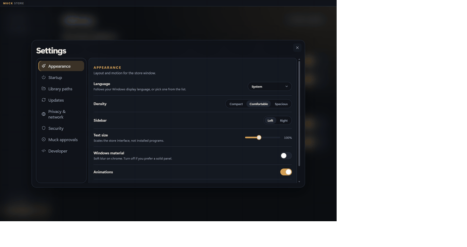

<p align="center">
  
</p>

<h1 align="center">Muck Store</h1>

<p align="center">
  <strong>Open-source program store for Windows.</strong><br/>
  Discover public GitHub apps, verify what they declare, install only that payload,<br/>
  then start, stop, update, and configure them — with no Muck backend.
</p>

<p align="center">
  <a href="https://github.com/tab2can/MuckStore/releases"></a>
  
  
  
</p>

<p align="center">
  
</p>

---

## What it is

Muck Store is a **client-only** store. The desktop app talks to GitHub. There is no Muck server that hosts your binary, no SDK to link, and no requirement that programs be written in a particular language.

You publish a normal Windows program. The store:

1. Finds it (official catalog, Discover search, or a pasted `owner/repo`)
2. Reads `muck.json`
3. Verifies license, hashes, and **GitHub Actions attestations** for Release assets
4. Asks the user to approve community programs
5. Installs into `%LOCALAPPDATA%\MuckStore\programs\{id}\{version}\`
6. Starts the entry with environment variables and optional launch arguments
7. Checks for updates on a schedule the user chose

A zip dropped onto Releases by hand is **not** enough. Release files must be built and attested by GitHub Actions **in that same repository**.

| You ship | The store does |
| --- | --- |
| Public GitHub repo + `muck.json` + `LICENSE` | Catalog card, program page, README gallery |
| GitHub topic `muck-store` | Discover search |
| Attested Release asset + SHA-256 | Hash check, provenance check, install |
| Semver tags (`v1.2.0`) | Update inbox, version picker, rollback folder |

**Shipping a program:** [docs/developer-guide.md](docs/developer-guide.md) · **Manifest fields:** [docs/manifest-spec.md](docs/manifest-spec.md) · **Attestations:** [docs/reproducible-builds.md](docs/reproducible-builds.md) · **Trust model:** [docs/security.md](docs/security.md)

---

## Features

### Catalog, not a dump of zips

Home surfaces official samples and community programs: stars, language, screenshots from the README, permission chips. Discover searches `topic:muck-store` or opens any public `owner/repo` that has a valid manifest.

### Trust you can read

Official catalog programs are copied from this checkout. Community programs show a verify report (public repo, SPDX license, asset hashes, Actions provenance). You approve; the ledger is `%APPDATA%\MuckStore\trust.json`. A new version or commit asks again. Defender still scans. The store never silently adds an exclusion.

<p align="center">
  
</p>

### Library that actually runs things

Start and stop from the store. Logs go to `%LOCALAPPDATA%\MuckStore\logs\{id}.log`. Program Settings (not a hidden schema form) cover version lock, GitHub release picker, launch arguments (`-test`), stable/preview channel, enabled, autostart, and the install folder.

<p align="center">
  
</p>

### Updates on your terms

Two policies, not a single toggle: **store app** and **installed programs**, each Automatic / At startup / Manual.

- Automatic still never kills the store window mid-session; a new store build is applied by `muck-updater.exe` at launch.
- Periodic checks (6 hours) plus a titlebar download icon when something is waiting.
- **Update all** applies the store updater and unlocked programs. New catalog items are informational only.

<p align="center">
  
</p>

### Themes without code

Token-only packs (colors, radius, type). No theme JavaScript. System appearance can follow Windows. See [docs/themes.md](docs/themes.md).

---

## Install (Windows 10 and 11)

Download from [Releases](https://github.com/tab2can/MuckStore/releases). Every push to `main` also builds installers as [Actions artifacts](https://github.com/tab2can/MuckStore/actions).

| Installer | Who |
| --- | --- |
| **x64 `.exe`** | 64-bit Windows 10 and 11 |
| **x86 `.exe`** | 32-bit Windows 10 (Windows 11 is 64-bit only) |

The Start Menu opens **muck-updater.exe** (small splash). It checks GitHub for a newer store build, then launches the store. On Windows 10 the installer bootstraps WebView2 if it is missing.

### Data folders

| Location | Role |
| --- | --- |
| `%LOCALAPPDATA%\Muck Store\` or `Program Files\Muck Store\` | The store application + updater |
| `%LOCALAPPDATA%\MuckStore\programs\` | Installed programs |
| `%LOCALAPPDATA%\MuckStore\cache\` | GitHub and download cache |
| `%LOCALAPPDATA%\MuckStore\logs\` | Program stdout/stderr |
| `%APPDATA%\MuckStore\` | Settings, approval ledger, themes |
| `%APPDATA%\MuckStore\config\` | Per-program JSON (`MUCK_SETTINGS_PATH`) |

---

## For program authors

No SDK. Any language. Public GitHub only.

1. Add `muck.json` (root or `.muck/muck.json`) and a `LICENSE` file.
2. Set GitHub topic **`muck-store`**.
3. If you ship a Release zip/msi: copy [docs/examples/release.yml](docs/examples/release.yml), attest the **same bytes** you upload, put the SHA-256 in the manifest.
4. Validate: `node cli/muck-validate.mjs .`
5. Tag `v1.0.0`. In the store: Discover → paste `owner/repo` → Install.

The store launches `entry` with:

| Variable | Meaning |
| --- | --- |
| `MUCK_PROGRAM_DIR` | Install directory |
| `MUCK_PROGRAM_ID` | Reverse-DNS id |
| `MUCK_SETTINGS_PATH` | `%APPDATA%\MuckStore\config\{id}.json` |

Sideload a local folder from Settings → Developer while you iterate. Sideload does not replace attestation for other people’s GitHub installs.

Full playbook: [docs/developer-guide.md](docs/developer-guide.md).

---

## Develop this repo

Requires Windows 10/11, [Node.js](https://nodejs.org/) 20+, [Rust](https://rustup.rs/) 1.77+.

```bash
npm install
npm run tauri dev
```

UI-only (browser mock, no installer):

```bash
npm run dev
```

Validate bundled sample manifests:

```bash
npm run validate
```

Shipping **Muck Store itself** (version, tag, NSIS): [docs/releasing.md](docs/releasing.md).

### Layout

| Path | Role |
| --- | --- |
| `src/` | React shell |
| `src-tauri/` | Rust engine (catalog, install, process, helper/UAC) |
| `src-tauri/updater/` | Splash updater (`muck-updater.exe`) |
| `schema/` | `muck.json` and theme JSON Schema |
| `catalog/` | Official and community indexes |
| `programs/` | First-party samples and an untrusted demo |
| `cli/muck-validate.mjs` | Publisher checks |
| `docs/` | Developer, security, release, and theme guides |

---

## License

MIT. Programs you install keep their own licenses.
